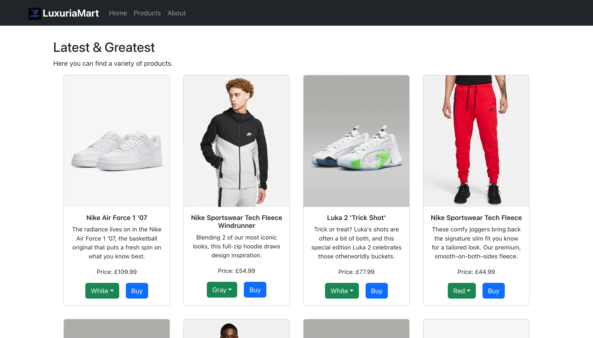

# LuxuriaMart

LuxuriaMart is a multi-page online store built using React, React Router, and Bootstrap. This project was developed as part of my task for Full Stack Web Development bootcamp at HyperionDev.



## Table of Contents

- [Features](#features)
- [Technologies Used](#technologies-used)
- [Installation](#installation)
- [Usage](#usage)
- [Project Structure](#project-structure)
- [Contributing](#contributing)
- [License](#license)

## Features

- **Home Page**: 
  - Login functionality that personalises the welcome message.
  - Button toggles between "Login" and "Logout".

- **Products Page**: 
  - Displays a list of products with Bootstrap cards.
  - Each product has multiple color options and a "Buy" button.
  - Color selection updates the product image.

- **About Page**: 
  - Information about the store including logo, description, images, and contact details.

## Technologies Used

- **React**: For building the user interface.
- **React Router**: For managing navigation between pages.
- **Bootstrap**: For responsive design and styling.
- **React Bootstrap**: For Bootstrap components specifically designed for React.

## Installation

1. Clone the repository:
   ```bash
   git clone https://github.com/Damilordz/luxuria_mart.git
   ```
2. Navigate to the project directory:
   ```bash
   cd luxuriamart
   ```
3. Install dependencies:
   ``` bash
   npm install
   ```
   
## Usage

1. Start the development server:
   ```` bash
   npm start
   ```
2. Open your browser and go to http://localhost:3000 to view the application.
3. Explore the LuxuriaMart website and its features.


## Project Structure
```
luxuria_mart/
├── public/
│   ├── index.html
│   └── ...
├── src/
│   ├── assets/
│   │   ├── images/
│   │   │   ├── logo.png
│   │   │   ├── product_images/
│   │   │   │   ├── air_force_1/
│   │   │   │   │   ├── white.jpeg
│   │   │   │   │   ├── black.jpeg
│   │   │   │   │   ├── yellow.jpeg
│   │   │   │   ├── ...
│   ├── components/
│   │   ├── Header.js
│   │   ├── ProductCard.js
│   │   └── TotalPrice.js
│   ├── pages/
│   │   ├── Home.js
│   │   ├── Products.js
│   │   └── About.js
│   ├── App.js
│   ├── index.js
│   └── productData.js
├── package.json
└── README.md
```

## Contributing

Contributions are welcome! Please open an issue or submit a pull request if you would like to contribute to this project.

